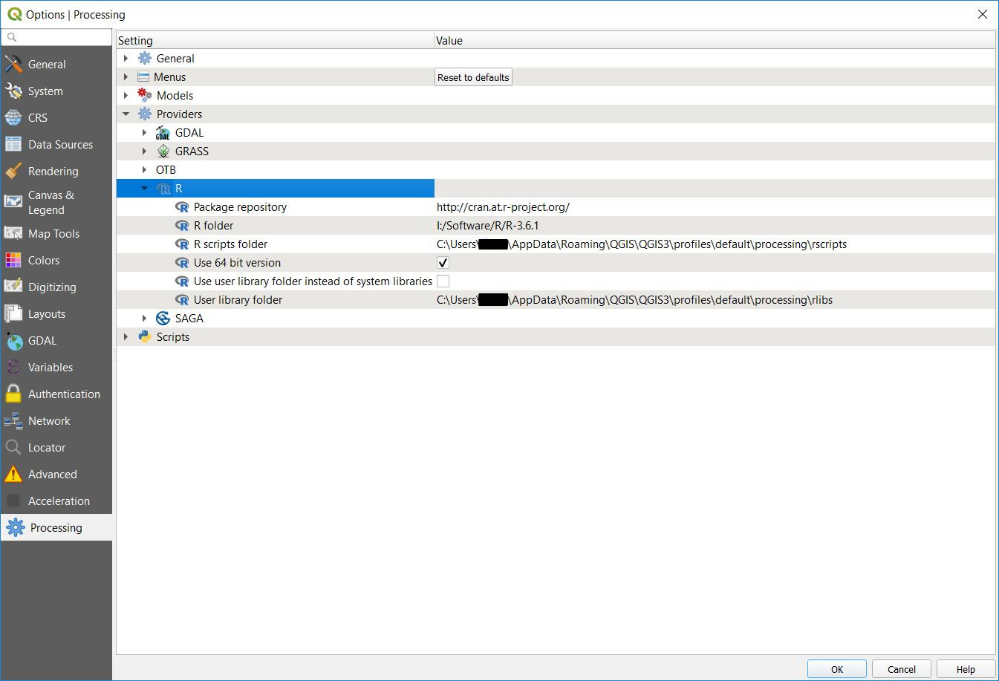

```{r setup, include=FALSE}
options(htmltools.dir.version = FALSE)
```

```{r xaringan-themer, include=FALSE}
library(xaringanthemer)
mono_accent(header_h1_font_size = "60px",
            text_font_size = "26px",
            text_font_google   = google_font("Roboto"),
            code_font_google   = google_font("Fira Sans")
  )
```

class: inverse, center, middle

# Obsah

---

# Obsah

- Interakce různých nástrojů
- QGIS
  - Instalace
  - **Processing R Provider** Plugin - [odkaz na web](https://north-road.github.io/qgis-processing-r/)
  - Nastavení 
  - Struktura skriptu
  - Ukázkové skripty
- ArcGIS
  - Instalace
  - **R Bridge** - [odkaz na web](https://r-arcgis.github.io/)
  - Struktura skriptu
  - Ukázky
- Srovnání

---

# Interakce různých nástrojů

- obecná snaha vyhnout se přenášení dat (obecně práce) mezi různými nástroji a prostředími

- snaha maximálně využít a zkombinovat dostupná řešení a nástroje (zabránění duplikace práce) 
  - typický příklad: implementace jedné knihovny v několika jazycích
  
- rozdíl v přístupu mezi __open source__ a __placeným softwarem__

- ideálně vytvoření bezešvého prostředí:
  - uživatel neřeší, kde a čím jsou data zpracovávána
  - tvůrce (programátor), má co nejvolnější ruku pro práci, aniž by musel řešit podružné drobnosti 

---

# **R** & **GIS**

- silné stránky
  - **GIS** - prostorová data, zpracování a vizualizace prostorových dat, uživatelská přístupnost
  - **R** - zpracování dat, statistika, modelování, vizualizace dat (grafy)
  
- slabé stránky
  - **GIS** - statistické nástroje, zpracování dat, vizualizace dat (grafy)   
  - **R** - vizualizace prostorových dat (?), uživatelská přístupnost(?)
  
- zpracování prostorových dat v **R** má téměř 20 letou historii, z toho 15 let existují specializované balíky na prostorová data, poslední 3 roky výrazná modernizace (balíky __sf__, __stars__ etc.)

---
class: inverse, center, middle

# QGIS

---

# Instalace

- [QGIS](https://qgis.org/en/site/forusers/download.html) minimálně verzi 3.10 (LTR), ale lépe aktuální 3.12
  - na Windows doporučuji instalaci [OSGeo4W](https://trac.osgeo.org/osgeo4w/), možnost používat i vývojovou verzi QGIS
  
- [R](https://cran.r-project.org/) aktuální verzi

- doporučené [RStudio](https://rstudio.com/products/rstudio/download/#download) pro psaní komplexnější R skriptů

- **Processing R Provider** Plugin
  - instalace z QGIS - menu **Plugins** -> **Manage and install Plugins...** -> **All** -> **Processing R Provider** -> **Install Plugin**
  
---
# Nastavení

- QGIS Menu -> **Settings** -> **Options** -> **Processing** -> **Providers** -> **R**

- je třeba nastavit či zkontrolovat proměnné
  - **R folder** - odkaz do složky se spustitelným souborem **R**
  - **R scripts folder** - odkaz na složky, kde se hledají **R skripty** pro spuštění, lze jich mít více, oddělují se `;`
  - může být problém se zapisováním knihoven, pak je nutné změnit nastavení **Use user R library...**, nebo spouštět **QGIS** s admin právy

- .highlight[pozor na updaty R, mohou způsobit, že nastavení nebudou platná]
  
---



---
# Struktura skriptu

- skripty jsou textové soubory s příponou **.rsx**

- začátek skriptu je několik řádek uvozených `##`, tzv. hlavička skriptu, která určuje, jak bude QGIS **R skript** načítat a pracovat s ním

- zbytek skriptu je běžný **R kód** pro zpracování dat

- pokud chceme ze skriptu tisknout nějaké výstupy do logu nástroje v QGIS, je třeba uvodit řádek znakem `>`

---

# Hlavička skriptu - Metadata skriptu

- `##jmeno skriptu=name` - název skriptu v toolboxu

- `##jmeno kategorie=group` - kategorizace skriptů do skupin

- .highlight[oba údaje je vhodné vyplňovat, pro lepší orientaci ve skriptech]

---

# Hlavička skriptu - Chování skriptu

- `##output_plots_to_html`

- `##load_raster_using_rgdal` (starší verze `##dontuserasterpackage`), načíst raster pomocí balíků **rgdal** a **sp**, alternativa je balík **raster**

- `##load_vector_using_rgdal` načte vektor pomocí balíků **rgdal** a **sp**, jinak se použije balík **sf**

- `##pass_filenames` nepředává data přímo do skriptu, pouze názvy a cesty k souborům, další zpracování je nutné v rámci skriptu

---

# Hlavička skriptu - Vstupní proměnné

- `##variable_name=variable_type [default_value/from_variable]`

- typy proměnných - .hl_kw[vector, raster, table, number, string, boolean, Field]

- pro proměnné typu .hl_kw[number, string] a .hl_kw[boolean] lze nastavit výchozí hodnotu

- pro .hl_kw[Field] lze nastavit hlavní proměnnou, ze které se pole přebere (určí se názvem proměnné)

- takto definované proměnné budou dostupné pro zbytek **R skriptu**

```
##Layer=vector

##Size=number 10

##X=Field Layer
```
---

# Hlavička - Výstupní proměnné

- `##variable_name=output output_type`

- typy proměnných - .hl_kw[layer, raster, folder, HTML, number, string, table]

- určují, které proměnné ze skriptu se budou předávat zpět do prostředí QGIS

```
##New_layer=output vector

##New_raster=output raster
```
---

# Chování skriptu

- na základě hlavičky skritpu se vytvoří GUI nástroje

- podle chování skriptu se automaticky načtou nezbytné balíky buď **rgdal** a **sp** nebo **sf** či **raster**

- pokud skript specifikuje načtení knihovny např. `library(dplyr)`, automaticky se kontroluje dostupnost knihovny a případně je nainstalována 

- .highlight[je potřeba dávat pozor na skripty, používající knihovny instalovaná z neoficiálních zdrojů (např. GitHub atd.), mohou způsobit problém, pokud knihovna není nainstalována (nelze ji automaticky jednoduše nainstalovat)]
  - jedna z ukázek

---
class: inverse, center, middle

# Ukázky

---

# Ukázka 1

- pro danou vrstvu a atribut vytvoříme histogram s definovaným počtem intervalů

---

# Ukázka 2

- stažení vektorové vrstvy a její zobrazení v QGIS

---

# Ukázka 3

- stažení dat a přidání do QGIS v podobě tabulky

- před samotným spuštěním skriptu je třeba nainstalovat knihovny, které nejsou z centrálního repozitáře

- buď v **RStudiu** nebo **RGui** spustit následující příkazy

```{r, eval=FALSE}
install.packages("remotes")
remotes::install_github("JanCaha/CzechData")
```

---

# Ukázka 4

- vytvoření jednoduchého regresního modelu na prostorových datech

---

# Ukázka 5

- vyhlazování pomocí Kernel Density Estimation (KDE) na vektorovém podkladě

- je potřeba instalace knihovny z GitHubu jako v případě Ukázky 3

---

# Ukázka 6

- fokální vyhlazení rastru s možností nastavení velikosti okna (číslo musí být liché!)

---

# Ukázky na webu pluginu

- [https://north-road.github.io/qgis-processing-r/](https://north-road.github.io/qgis-processing-r/)

---
class: inverse, center, middle

# ArcGIS

---

# Instalace

- **ArcGIS** nebo **ArcGIS Pro**
  
- [R](https://cran.r-project.org/) aktuální verzi

- doporučené [RStudio](https://rstudio.com/products/rstudio/download/#download) pro psaní komplexnější R skriptů

- **R Bridge** - [odkaz na web](https://r-arcgis.github.io/)
  - instalace detailně popsána na [GitHubu](https://github.com/R-ArcGIS/r-bridge-install)
  
- [ukázkový toolbox](https://github.com/R-ArcGIS/r-sample-tools)

---

# Nastavení

- provádí se skrze toolbox **R Bridge**

- GUI rozhraní toolboxu i samotných nástrojů se musí vytvořit přes **ArcCatalog**, stejně jako pro skripty v **Pythonu**

- přístup k nástrojům je shodný jako v případě **Pythonu** 

---

# Struktura skriptu

- nutnostní je existence funkce, skrze kterou se skript spouští

```{r, eval=FALSE}
tool_exec <- function(in_params, out_params)
{}
```

- v rámci této funkce musí uživatel obstarat 
  - načtení a případně instalaci knihoven
  - načtení dat
  
- pomocné funkce `arc.*`
  - skrze některé možnost interakce s prostředím ArcGISu
  - čtení a zápis dat 
  - atd.

---

# Ukázky z R sample tools

- [link](https://github.com/R-ArcGIS/r-sample-tools)

- řešení knihoven

- načítání dat a kompletace dat

---
class: inverse, center, middle

# Zhodnocení

---

# Srovnání

- možnost používat **R** jak z **QGIS** tak i z **ArcGIS**

- možnost relativně plynule využívat spojení GIS a jazyka zaměřeného na zpracování a statistickou analýzu dat

- dva odlišné přístupy, z čehož jeden je výrazně jednodušší a přístupnější

- plugin pro **QGIS** je stále relativně ve vývoji aktuálně s několika návrhy na vylepšení či změny  

---
class: inverse, center, middle

# Děkuji za pozornost!
